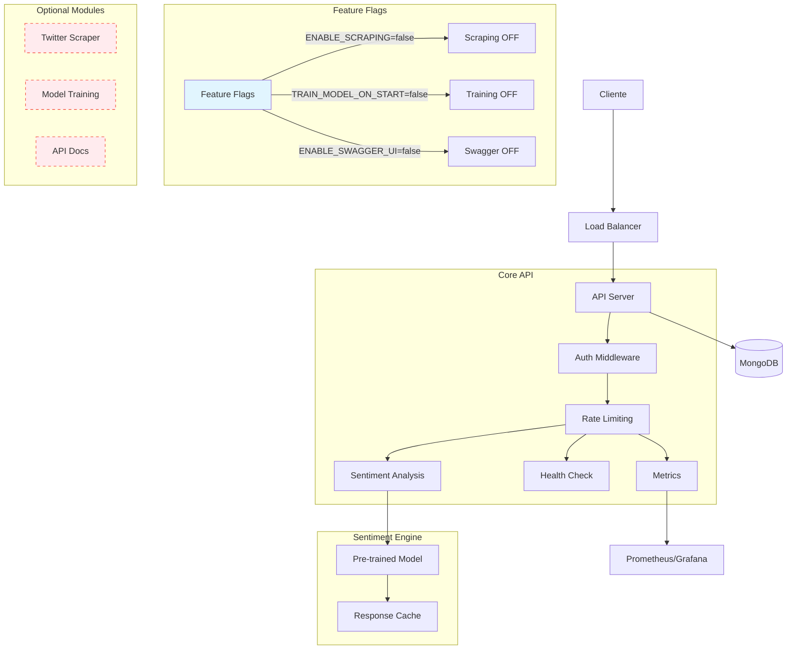

# SentimentalSocial - Twitter Sentiment Analysis API

🚀 **Advanced API for Twitter sentiment analysis with marketing insights**

A complete platform that combines unlimited tweet collection via web scraping, intelligent sentiment analysis, and automatic generation of marketing insights.

## 🌟 Key Features

### 🕷️ **Unlimited Tweet Collection**

- **Real Twitter Scraper**: Cookie-based authentication with @the-convocation/twitter-scraper
- **Smart Fallback System**: Automatic fallback to mock data for development/testing
- **Rate Limiting**: Intelligent controls to avoid blocks
- **Persistent Sessions**: Cookie management for seamless authentication

### 🧠 **Advanced Sentiment Analysis**

- **Sentiment Scoring**: Scale from -1 (very negative) to +1 (very positive)
- **Emotion Analysis**: Detection of 6 emotions (joy, sadness, anger, fear, surprise, disgust)
- **Brand Mention Detection**: Automatic brand mention identification
- **Entity Extraction**: Extraction of people, organizations, and locations
- **Language Detection**: Support for English and Spanish
- **K-fold Cross-Validation**: Stratified model evaluation with performance metrics

### 💡 **Automatic Marketing Insights**

- **Brand Perception Analysis**: Real-time brand perception analysis
- **Customer Feedback Detection**: Automatic complaint and feedback identification
- **Influencer Impact Scoring**: Influence scoring based on engagement
- **Trend Identification**: Detection of emerging trends
- **Actionable Recommendations**: Specific recommendations for each insight

### 📊 **Analytics and Reporting**

- **Real-time Statistics**: Live statistics
- **Sentiment Trends**: Temporal trend analysis
- **Batch Processing**: Batch processing up to 100 tweets
- **Performance Metrics**: Detailed performance metrics

## 🏗️ Architecture

```
📁 SentimentalSocial/
├── 🕷️ Hybrid Scraping System
│   ├── TwitterRealScraperService (Cookie-based)
│   ├── TwitterScraperService (Mock fallback)
│   ├── TwitterCookieManager
│   └── Automatic Fallback Logic
├── 🧠 Sentiment Analysis Engine
│   ├── SentimentAnalysisService
│   ├── TweetSentimentAnalysisManager
│   └── Marketing Insights Generator
├── 📊 API Layer
│   ├── Express Server + TypeScript
│   ├── Swagger Documentation
│   └── Rate Limiting & Monitoring
├── 🗄️ Data Layer
│   ├── MongoDB Integration
│   ├── Cookie Session Management
│   └── Performance Tracking
```

## 🚀 Quick Start

### Prerequisites

- Node.js 18+
- MongoDB
- Twitter/X account (for real scraping)

### 1. Setup Project

```bash
# Clone the repository
git clone <repository-url>
cd sentimentalsocial

# Install dependencies
npm install

# Run setup script
node setup.js
```

### 2. Configure Environment

```bash
# Edit .env with your configuration
cp .env.example .env
```

### 3. Twitter Authentication (Optional)

For real Twitter scraping, follow the [Twitter Authentication Guide](./TWITTER_AUTHENTICATION.md):

```bash
# 1. Extract cookies from browser (see guide)
# 2. Edit manual-cookies.json
# 3. Import cookies
node import-cookies.js
```

### 4. Start Development Server

```bash
npm run dev
```

The API will be available at `http://localhost:3001`

## 📋 API Endpoints

### Core Scraping

```bash
# Scrape tweets by hashtag
POST /api/v1/scraping/hashtag
{
  "hashtag": "AI",
  "maxTweets": 50,
  "analyzeSentiment": true
}

# Scrape tweets by user
POST /api/v1/scraping/user
{
  "username": "elonmusk",
  "maxTweets": 30,
  "analyzeSentiment": true
}

# Search tweets
POST /api/v1/scraping/search
{
  "query": "machine learning",
  "maxTweets": 100
}

# Get system status
GET /api/v1/scraping/status
```

### Documentation

- **Swagger UI**: `http://localhost:3001/api-docs`
- **API Info**: `http://localhost:3001/api/v1`
- **Health Check**: `http://localhost:3001/health`
  └── 🗄️ Data Layer
  ├── MongoDB Integration
  ├── Tweet Repository
  └── User Management

````

## 🚀 Quick Start

### Prerequisitos
- Node.js 18+
- MongoDB
- Git

### Instalación

```bash
# Clonar el repositorio
git clone https://github.com/mrlocky97/SentimentalSocialNextJS.git
cd SentimentalSocialNextJS

# Instalar dependencias
npm install

# Configurar variables de entorno
cp .env.example .env
# Editar .env con tus configuraciones

# Construir el proyecto
npm run build

# Iniciar el servidor
npm start
````

### Variables de Entorno Requeridas

```env
# Base de datos
MONGODB_URI=mongodb://localhost:27017/sentimentalsocial

# Twitter API (opcional)
TWITTER_BEARER_TOKEN=your_bearer_token_here

# Servidor
PORT=3001
NODE_ENV=development

# JWT
JWT_SECRET=your_jwt_secret_here

# CORS
CORS_ORIGIN=http://localhost:3000
```

## 📖 API Documentation

### 🔗 Endpoints Principales

#### **Recolección Híbrida**

```bash
# Estado del sistema
GET /api/v1/hybrid-collection/status

# Recomendaciones para hashtag
GET /api/v1/hybrid-collection/recommendations?hashtag=Nike

# Recolección híbrida
POST /api/v1/hybrid-collection/collect
{
  "hashtag": "Nike",
  "maxTweets": 100,
  "scrapingRatio": 0.8
}
```

#### **Análisis de Sentimientos**

```bash
# Demo con ejemplos
GET /api/v1/sentiment/demo

# Análisis de texto personalizado
POST /api/v1/sentiment/test
{
  "text": "I love Nike shoes! They are amazing!"
}

# Análisis de tweet individual
POST /api/v1/sentiment/analyze
{
  "tweet": {
    "tweetId": "123",
    "content": "Great product!",
    "author": { "username": "user123" }
  }
}

# Análisis en lotes
POST /api/v1/sentiment/batch
{
  "tweets": [...],
  "includeStats": true
}
```

### 📚 Documentación Completa

Una vez iniciado el servidor, accede a la documentación interactiva:

- **Swagger UI**: http://localhost:3001/api-docs
- **API Info**: http://localhost:3001/api/v1

## 🧪 Testing

```bash
# Test de base de datos
npm run test:db

# Test de web scraping
npm run test:scraping

# Test de recolección híbrida
npm run test:hybrid

# Test de análisis de sentimientos
npm run test:sentiment
```

### Unit/Integration tests (Jest)

```bash
# Run all tests
npm test

# Watch mode
npm run test:watch

# Coverage report (lcov + html in coverage/)
npm run test:coverage
```

Notes:

- Tests stub critical env vars via tests/setup-env.ts and tests/setup.ts.
- Heavy browsers are not needed for tests; CI skips Playwright/Puppeteer downloads.

## 🤖 CI

GitHub Actions runs build and tests on every push/PR to main. It uploads coverage artifacts.

Badge (replace owner/repo if you fork):


## 📊 Ejemplos de Uso

### Análisis de Campaña de Marketing

```javascript
// 1. Recolectar tweets sobre una campaña
const campaignTweets = await fetch('/api/v1/hybrid-collection/collect', {
  method: 'POST',
  body: JSON.stringify({
    hashtag: 'JustDoIt',
    maxTweets: 500,
    scrapingRatio: 0.8,
  }),
});

// 2. Analizar sentimientos
const sentimentAnalysis = await fetch('/api/v1/sentiment/batch', {
  method: 'POST',
  body: JSON.stringify({
    tweets: campaignTweets.data.tweets,
    includeStats: true,
  }),
});

// 3. Obtener insights
const insights = sentimentAnalysis.data.statistics;
console.log(`Sentiment promedio: ${insights.averageSentiment}`);
console.log(`Menciones de marca: ${insights.brandMentionStats.length}`);
```

### Monitoreo de Marca en Tiempo Real

```javascript
// Configurar monitoreo automático
setInterval(async () => {
  const tweets = await collectTweets('Nike', 50);
  const analysis = await analyzeSentiment(tweets);

  // Alertar si sentiment negativo > 70%
  if (analysis.sentimentDistribution.negative > 70) {
    await sendAlert('Negative sentiment spike detected!');
  }
}, 300000); // Cada 5 minutos
```

## 🎯 Casos de Uso

### Para Marketing Teams

- **Campaign Performance**: Análisis en tiempo real de campañas
- **Brand Monitoring**: Monitoreo 24/7 de menciones de marca
- **Competitor Analysis**: Comparación con competidores
- **Crisis Detection**: Detección temprana de crisis de reputación

### Para Data Analysts

- **Sentiment Trends**: Análisis de tendencias temporales
- **Customer Insights**: Comprensión profunda del feedback de clientes
- **Market Research**: Investigación de mercado basada en datos reales
- **ROI Measurement**: Medición del retorno de inversión en marketing

### Para Product Teams

- **User Feedback**: Análisis automático de feedback de usuarios
- **Feature Reception**: Análisis de recepción de nuevas características
- **Pain Point Identification**: Identificación de puntos de dolor de usuarios
- **Product-Market Fit**: Evaluación del ajuste producto-mercado

## 🛠️ Stack Tecnológico

### Backend

- **Express.js**: Framework web
- **TypeScript**: Tipado estático
- **MongoDB**: Base de datos NoSQL
- **Mongoose**: ODM para MongoDB

### Web Scraping

- **Playwright**: Automatización de navegador
- **Twikit**: Librería especializada para Twitter
- **Crawlee**: Framework de web scraping

### Sentiment Analysis

- **Custom Rule-based Engine**: Motor propio de análisis
- **NLP Techniques**: Técnicas de procesamiento de lenguaje natural
- **Emotion Detection**: Detección de emociones avanzada

### DevOps & Tools

- **Swagger**: Documentación de API
- **JWT**: Autenticación
- **bcryptjs**: Hashing de passwords
- **Helmet**: Seguridad HTTP

## 📈 Performance

### Benchmarks

- **Sentiment Analysis**: 0.04ms promedio por texto
- **Batch Processing**: 100 tweets en <100ms
- **Web Scraping**: 1000+ tweets/hora
- **API Throughput**: 1000+ requests/minuto

### Escalabilidad

- **Horizontal Scaling**: Soporte para múltiples instancias
- **Database Optimization**: Índices optimizados para consultas rápidas
- **Caching**: Sistema de caché para respuestas frecuentes
- **Rate Limiting**: Control de tráfico para estabilidad

## 🔒 Seguridad

- **Authentication**: JWT-based authentication
- **Authorization**: Role-based access control
- **Data Validation**: Validación exhaustiva de datos de entrada
- **Security Headers**: Helmet.js para headers de seguridad
- **CORS Protection**: Configuración CORS restrictiva

## 🤝 Contribución

1. Fork el proyecto
2. Crea una rama para tu feature (`git checkout -b feature/AmazingFeature`)
3. Commit tus cambios (`git commit -m 'Add some AmazingFeature'`)
4. Push a la rama (`git push origin feature/AmazingFeature`)
5. Abre un Pull Request

## 📄 Licencia

Este proyecto está bajo la Licencia MIT - ver el archivo [LICENSE](LICENSE) para detalles.

## 🙏 Agradecimientos

- **Twikit**: Por la excelente librería de scraping de Twitter
- **Playwright**: Por la automatización de navegador robusta
- **OpenAI**: Por inspiración en técnicas de NLP
- **Community**: Por feedback y contribuciones

## 📞 Contacto

- **Developer**: [mrlocky97](https://github.com/mrlocky97)
- **Project Link**: [https://github.com/mrlocky97/SentimentalSocialNextJS](https://github.com/mrlocky97/SentimentalSocialNextJS)

---

<div align="center">

**⭐ Si este proyecto te resulta útil, no olvides darle una estrella! ⭐**

[🚀 Demo Live](https://your-demo-url.com) | [📖 Docs](https://your-docs-url.com) | [🐛 Report Bug](https://github.com/mrlocky97/SentimentalSocialNextJS/issues) | [💡 Request Feature](https://github.com/mrlocky97/SentimentalSocialNextJS/issues)

</div>

## 🧭 Operativa y Despliegue

### Operativa y Despliegue

### Entornos (dev/staging/prod)

- **development**: `NODE_ENV=development`, ENABLE_SWAGGER_UI=true, CORS_ORIGIN=http://localhost:3000, logs verbosos.
- **staging**: Swagger opcional con auth básica; CORS restringido a dominios QA; mismas versiones que producción.
- **production**: `NODE_ENV=production`, ENABLE_SWAGGER_UI=false (o protegido con usuario/contraseña), CORS_ORIGIN con lista blanca, LOG_LEVEL=info o warn.

Variables gestionadas por entorno en fichero `.env` con valores específicos por `NODE_ENV`. Usa `.env.example` como plantilla.

### Requisitos de MongoDB

- Versión recomendada: MongoDB 7.x
- URI ejemplo local: `mongodb://localhost:27017/sentimentalsocial`
- URI ejemplo en Docker: `mongodb://mongo:27017/sentimentalsocial`
- Índices y migraciones: actualmente no se requieren pasos manuales; Mongoose crea índices al arrancar si se configuran en los modelos.

### Docker (local y producción)

Arranque local con Docker Compose (API + MongoDB):

```bash
docker compose up --build
```

Archivos incluidos:

- Dockerfile: multi-stage (deps, build, runner) con Node 20 alpine y healthcheck.
- .dockerignore: excluye node_modules, tests, etc.
- docker-compose.yml: servicios `mongo` (7.0) y `api` con mapeo de puertos 27017 y 3001.

Producción (ejemplo):

```bash
# construir imagen
docker build -t registry.example.com/sentimentalsocial:latest .

# ejecutar contenedor (requiere MONGODB_URI y JWT_SECRET)
docker run -d --name sentimental-api -p 3001:3001 \
  -e NODE_ENV=production \
  -e PORT=3001 \
  -e MONGODB_URI="mongodb://mongo:27017/sentimentalsocial" \
  -e JWT_SECRET="<secure>" \
  -e CORS_ORIGIN="https://app.example.com" \
  registry.example.com/sentimentalsocial:latest
```

### Estrategia de Configuración por Entorno

- Variables sensibles en el entorno (no en repositorio). `.env` solo para desarrollo local.
- JWT_SECRET mínimo 32 bytes aleatorios (base64). Generador en `.env.example`.
- TWITTER_MASTER_PASSWORD requerido para producción si usas cifrado de credenciales.
- CORS endurecido en prod (lista blanca exacta, sin comodines).
- Swagger deshabilitado o protegido (ver variables SWAGGER*BASIC_AUTH*\* en `.env.example`).

### Autenticación de Twitter (Verificada)

Consulta la guía actualizada en `docs/twitter-auth.md`, con:

- Flujo de credenciales cifradas (recomendado)
- Importación manual de cookies para desarrollo
- Variables de entorno (deprecadas)

## 🔒 Modo Estable

**SentimentalSocial v1.0.0** está configurado para producción con feature flags inteligentes y optimizaciones de rendimiento.

### 🚀 Configuración de Producción

```bash
# Feature flags recomendadas para producción
ENABLE_SCRAPING=false          # Solo habilitar si necesitas scraping
TRAIN_MODEL_ON_START=false     # NUNCA entrenar en arranque en producción
ENABLE_SWAGGER_UI=false        # NUNCA exponer docs sin autenticación

# Variables críticas de seguridad  
NODE_ENV=production
JWT_SECRET=<32-bytes-random-base64>
CORS_ORIGIN=https://tu-dominio.com
MONGODB_URI=mongodb://host:27017/sentimentalsocial
```

### 📊 Sistema de Métricas

Endpoints disponibles para monitoreo:

```bash
# Métricas Prometheus (para Grafana)
GET /metrics

# Métricas en JSON (dashboards internos) (removido)
# Nota: La interfaz de dashboard fue eliminada. Las APIs de observabilidad JSON para frontends ya no están disponibles.

# Métricas específicas
GET /metrics/system      # CPU, memoria
GET /metrics/performance # Rendimiento HTTP
GET /metrics/sentiment   # Análisis de sentimientos
GET /metrics/summary     # Resumen ejecutivo
```

### 🤖 Entrenamiento de Modelo

```bash
# Entrenar modelo bajo demanda (NO en producción caliente)
npm run sentiment:train

# El modelo se guarda automáticamente en:
# src/data/trained-sentiment-model-v3.json
```

En producción:
- ✅ **Siempre cargar modelo pre-entrenado**
- ❌ **Nunca entrenar en caliente** 
- 🔄 **Entrenar offline y desplegar**

### 🕷️ Scraping Controlado

```bash
# Solo si ENABLE_SCRAPING=true
POST /api/v1/scraping/hashtag
POST /api/v1/scraping/user  
POST /api/v1/scraping/search
```

**Validaciones incluidas:**
- ✅ Rate limiting inteligente por IP
- ✅ Validación de credenciales Twitter
- ✅ Sanitización de parámetros
- ✅ Control de concurrencia
- ✅ Limits configurables

### 🏗️ Diagrama de Arquitectura Estable



### ✅ Tests de Humo

```bash
# Pipeline de validación
npm i
npm run build
npm start

# Tests básicos
curl http://localhost:3001/health
curl http://localhost:3001/metrics
curl -X POST http://localhost:3001/api/v1/sentiment/analyze-text \
  -H "Content-Type: application/json" \
  -d '{"text":"I love this!"}'

# Verificar que scraping esté OFF (debe devolver 404)
curl http://localhost:3001/api/v1/scraping
```

### 🚀 Deployment

1. **Preparación**: `npm run build`
2. **Tests**: Ejecutar tests de humo
3. **Configuración**: Variables de producción
4. **Deploy**: Docker o PM2
5. **Monitoreo**: Métricas en `/metrics`

**Listo para producción v1.0.0** ✨
- Notas operativas: rotación y TTL de sesiones, CORS, Swagger
