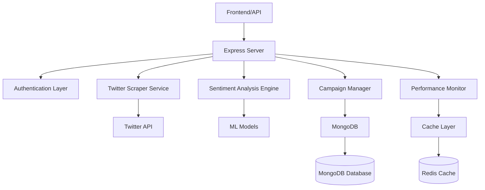

# 📚 SentimentalSocial - Technical Documentation

## 🎯 Overview

SentimentalSocial is a comprehensive social media sentiment analysis platform that provides real-time monitoring, analysis, and insights for brands, campaigns, and social media strategies.

## 🏗️ Architecture

### System Components



### Core Services

1. **Twitter Scraper Service** - Collects social media data
2. **Sentiment Analysis Engine** - Processes text for sentiment and emotions
3. **Campaign Management** - Manages monitoring campaigns
4. **Performance Optimization** - Caches and optimizes queries
5. **Authentication** - Secure user management
6. **Real-time Processing** - Stream processing for live data

## 🚀 Getting Started

### Prerequisites

- Node.js 18+ 
- MongoDB 6+
- TypeScript 5+
- Redis (optional, for caching)

### Installation

```bash
# Clone repository
git clone https://github.com/mrlocky97/SentimentalSocialNextJS.git
cd SentimentalSocialNextJS

# Install dependencies
npm install

# Setup environment
cp .env.example .env
# Edit .env with your configuration

# Build project
npm run build

# Run tests
npm test

# Start development server
npm run dev
```

### Environment Configuration

```env
# Database
MONGODB_URI=mongodb://localhost:27017/sentimentalsocial

# Authentication
JWT_SECRET=your-secret-key

# Twitter API (optional)
TWITTER_EMAIL=your-email
TWITTER_USERNAME=your-username
TWITTER_PASSWORD=your-password

# Performance
CACHE_TTL=300000
MAX_CONCURRENT_QUERIES=5
```

## 🔧 API Reference

### Authentication

#### POST /api/auth/login
Login with credentials

```typescript
interface LoginRequest {
  email: string;
  password: string;
}

interface LoginResponse {
  success: boolean;
  token: string;
  user: {
    id: string;
    email: string;
    role: string;
  };
}
```

#### POST /api/auth/register
Register new user

```typescript
interface RegisterRequest {
  email: string;
  password: string;
  name: string;
}
```

### Sentiment Analysis

#### POST /api/sentiment/analyze
Analyze text sentiment

```typescript
interface SentimentRequest {
  text: string;
  method?: 'naive' | 'rule' | 'ml' | 'advanced' | 'hybrid';
}

interface SentimentResponse {
  label: string;
  confidence: number;
  score: number;
  method: string;
  explanation: string;
  languageAnalysis: {
    detectedLanguage: string;
    emotionalIntensity: number;
    textStats: {
      length: number;
      complexity: number;
    };
  };
}
```

### Campaign Management

#### POST /api/campaigns
Create new campaign

```typescript
interface CreateCampaignRequest {
  name: string;
  description: string;
  hashtags: string[];
  keywords: string[];
  settings: {
    sentimentAnalysis: boolean;
    emotionAnalysis: boolean;
    influencerAnalysis: boolean;
  };
}
```

#### GET /api/campaigns/:id/metrics
Get campaign metrics

```typescript
interface CampaignMetrics {
  totalTweets: number;
  sentimentScore: number;
  avgEngagementRate: number;
  topHashtags: Array<{ hashtag: string; count: number }>;
  sentimentDistribution: {
    positive: number;
    neutral: number;
    negative: number;
  };
}
```

## 🔍 Core Modules

### Sentiment Analysis Engine

The sentiment analysis engine supports multiple methods:

#### 1. Naive Bayes Classifier
- Fast, lightweight
- Good for basic sentiment detection
- Trained on social media data

```typescript
import { NaiveBayesSentimentAnalyzer } from '@/services/naive-bayes-sentiment.service';

const analyzer = new NaiveBayesSentimentAnalyzer();
const result = await analyzer.analyze("I love this product!");
```

#### 2. Rule-Based Analysis
- Pattern matching
- Domain-specific rules
- Multilingual support

```typescript
import { InternalSentimentAnalyzer } from '@/services/internal-sentiment-analyzer.service';

const analyzer = new InternalSentimentAnalyzer();
const result = await analyzer.analyze("This is amazing!");
```

#### 3. Hybrid System
- Combines multiple approaches
- Confidence weighting
- Best accuracy

```typescript
import { HybridSentimentAnalyzer } from '@/services/hybrid-sentiment.service';

const analyzer = new HybridSentimentAnalyzer();
const result = await analyzer.analyze("Complex sentiment text...");
```

### Performance Optimization

#### Caching System
```typescript
import { performanceCache } from '@/services/performance-cache.service';

// Cache with TTL
performanceCache.set('key', data, 300000); // 5 minutes

// Retrieve from cache
const cached = performanceCache.get('key');

// Generate cache key
const key = performanceCache.generateKey('sentiment', userId, text);
```

#### Query Optimization
```typescript
import { queryOptimizer } from '@/services/query-optimization.service';

// Optimized query with caching
const result = await queryOptimizer.executeQuery(
  'tweets:user:123',
  () => getTweetsByUser(123),
  { ttl: 600000 } // 10 minutes
);

// Batch processing
const results = await queryOptimizer.executeBatch([
  { key: 'query1', fn: () => query1() },
  { key: 'query2', fn: () => query2() },
]);
```

### Performance Monitoring

```typescript
import { performanceMonitor } from '@/services/performance-monitoring.service';

// Track endpoint performance
performanceMonitor.trackEndpoint('GET', '/api/campaigns', 200, 150);

// Measure function execution
const result = await performanceMonitor.measureExecutionTime(
  'sentiment_analysis',
  () => analyzeSentiment(text)
);

// Generate performance report
const report = performanceMonitor.generateReport();
```

## 🧪 Testing

### Test Structure

```
tests/
├── api/                 # API endpoint tests
├── services/            # Service unit tests
├── utils/               # Utility tests
└── setup.ts            # Test configuration
```

### Running Tests

```bash
# All tests
npm test

# Unit tests only
npm run test:unit

# Integration tests only
npm run test:integration

# With coverage
npm run test:coverage

# Watch mode
npm run test:watch
```

### Test Examples

```typescript
// Service test example
describe('SentimentAnalysisService', () => {
  it('should analyze positive sentiment correctly', async () => {
    const result = await sentimentService.analyze('I love this!');
    
    expect(result.label).toBe('positive');
    expect(result.confidence).toBeGreaterThan(0.8);
  });
});

// API test example
describe('GET /api/sentiment/test', () => {
  it('should return sentiment analysis result', async () => {
    const response = await request(app)
      .get('/api/sentiment/test')
      .expect(200);
      
    expect(response.body).toHaveProperty('label');
    expect(response.body).toHaveProperty('confidence');
  });
});
```

## 🚀 Deployment

### Docker Deployment

```dockerfile
FROM node:18-alpine

WORKDIR /app

COPY package*.json ./
RUN npm ci --only=production

COPY dist/ ./dist/
COPY src/ ./src/

EXPOSE 3000

CMD ["npm", "start"]
```

### Build Commands

```bash
# Build for production
npm run build

# Start production server
npm start

# Docker build
docker build -t sentimentalsocial .

# Docker run
docker run -p 3000:3000 sentimentalsocial
```

### Environment Setup

#### Development
```bash
npm run dev
```

#### Production
```bash
npm run build
npm start
```

## 📊 Performance Guidelines

### Response Time Targets

- API endpoints: < 200ms (95th percentile)
- Sentiment analysis: < 500ms per request
- Campaign metrics: < 1s for complex aggregations
- Real-time updates: < 100ms

### Optimization Best Practices

1. **Caching Strategy**
   - Cache frequent queries for 5-10 minutes
   - Use cache keys based on query parameters
   - Implement cache invalidation on data updates

2. **Database Optimization**
   - Index frequently queried fields
   - Use aggregation pipelines efficiently
   - Implement pagination for large datasets

3. **Memory Management**
   - Monitor heap usage
   - Implement cleanup for long-running processes
   - Use streaming for large data processing

## 🔒 Security

### Authentication
- JWT tokens with secure secrets
- Password hashing with bcrypt
- Rate limiting on sensitive endpoints

### Data Protection
- Input validation and sanitization
- SQL injection prevention
- XSS protection headers

### API Security
```typescript
// Rate limiting example
import rateLimit from 'express-rate-limit';

const limiter = rateLimit({
  windowMs: 15 * 60 * 1000, // 15 minutes
  max: 100, // limit each IP to 100 requests per windowMs
  message: 'Too many requests from this IP'
});

app.use('/api/', limiter);
```

## 🐛 Troubleshooting

### Common Issues

#### High Memory Usage
```bash
# Check memory usage
npm run monitor:memory

# Analyze heap dump
node --inspect dist/server.js
```

#### Slow Query Performance
```bash
# Check query metrics
npm run analyze:queries

# Enable query profiling
ENABLE_QUERY_PROFILING=true npm start
```

#### Cache Issues
```bash
# Clear cache
npm run cache:clear

# Check cache stats
npm run cache:stats
```

### Debug Mode

```bash
# Start with debugging
npm run debug

# Debug with breakpoints
npm run debug:break

# Production debugging
npm run debug:prod
```

## 📈 Monitoring

### Metrics Collection

```typescript
// Custom metrics
performanceMonitor.recordMetric(
  'custom_operation',
  executionTime,
  'ms',
  'response_time'
);

// Automatic endpoint tracking
app.use(performanceMiddleware);
```

### Health Checks

```bash
# Application health
curl http://localhost:3000/health

# Database connectivity
curl http://localhost:3000/health/db

# Cache status
curl http://localhost:3000/health/cache
```

## 🤝 Contributing

### Development Workflow

1. Create feature branch from `develop`
2. Write tests for new functionality
3. Ensure all tests pass
4. Submit pull request
5. Code review and merge

### Code Standards

- Use TypeScript for all new code
- Follow ESLint configuration
- Write unit tests for services
- Document public APIs
- Use conventional commit messages

### Pull Request Template

```markdown
## Description
Brief description of changes

## Type of Change
- [ ] Bug fix
- [ ] New feature
- [ ] Breaking change
- [ ] Documentation update

## Testing
- [ ] Unit tests pass
- [ ] Integration tests pass
- [ ] Manual testing completed

## Checklist
- [ ] Code follows style guidelines
- [ ] Self-review completed
- [ ] Documentation updated
```

## 📚 Additional Resources

- [API Documentation](./api-docs.md)
- [Database Schema](./database-schema.md)
- [Performance Tuning Guide](./performance-guide.md)
- [Deployment Guide](./deployment-guide.md)
- [Security Guidelines](./security-guide.md)

## 📞 Support

For technical support or questions:
- Create an issue in GitHub
- Check existing documentation
- Review test examples
- Contact the development team

---

*Last updated: $(date)*
*Version: 1.0.0*
