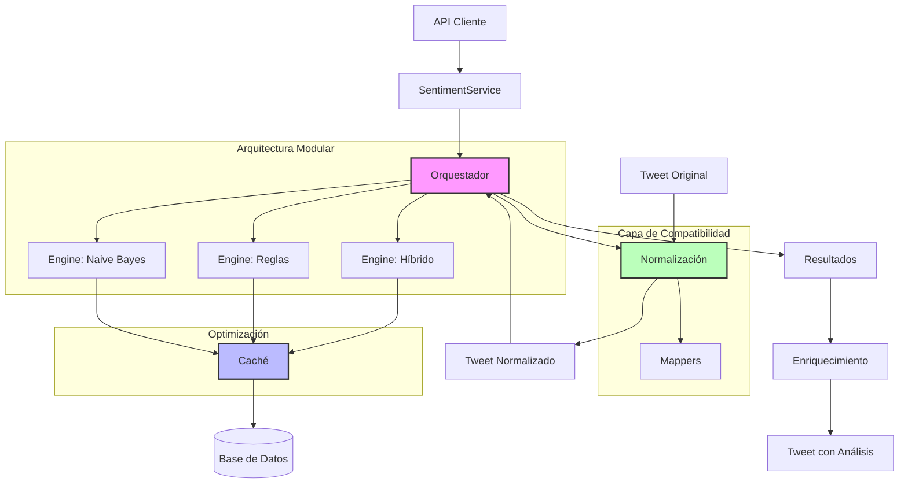

# Diagrama de Arquitectura: Sistema Unificado de Análisis de Sentimiento

## Descripción de Componentes

### 1. Orquestador Central

- Gestiona múltiples motores de análisis
- Decide qué motor utilizar según contexto
- Combina resultados para mejorar precisión

### 2. Motores de Análisis

- **Naive Bayes**: Rápido, entrenado con datos históricos
- **Reglas**: Análisis lingüístico avanzado
- **Híbrido**: Combina métodos para máxima precisión

### 3. Sistema de Caché

- Evita análisis redundantes
- Almacena resultados por ID de tweet
- Configurable por tiempo de expiración

### 4. Normalización

- Convierte formatos antiguos y nuevos
- Garantiza compatibilidad con sistemas existentes
- Mappers para transformación bidireccional

### 5. Enriquecimiento

- Añade resultados de análisis a tweets
- Genera estadísticas agregadas
- Proporciona insights de marketing
